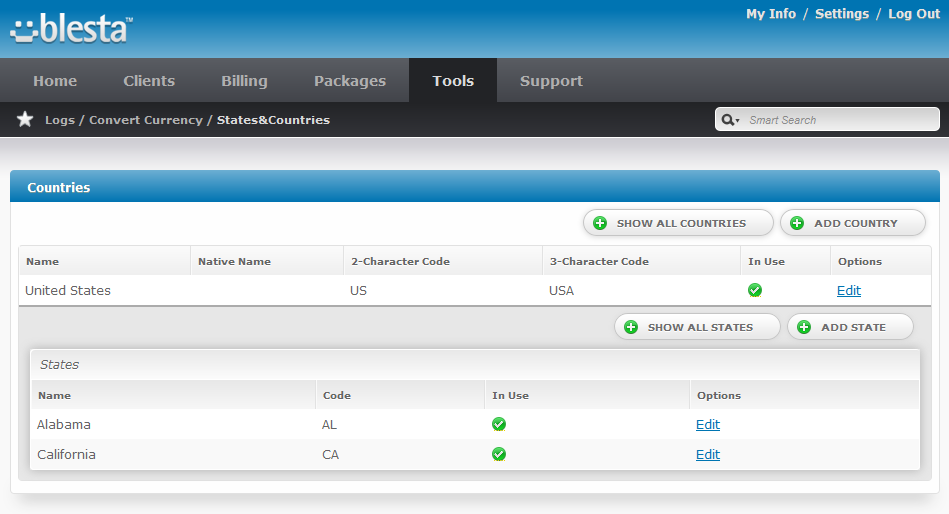
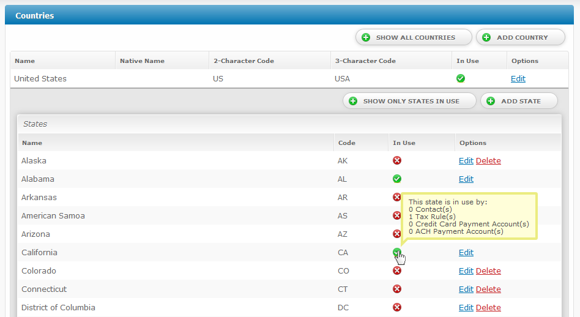
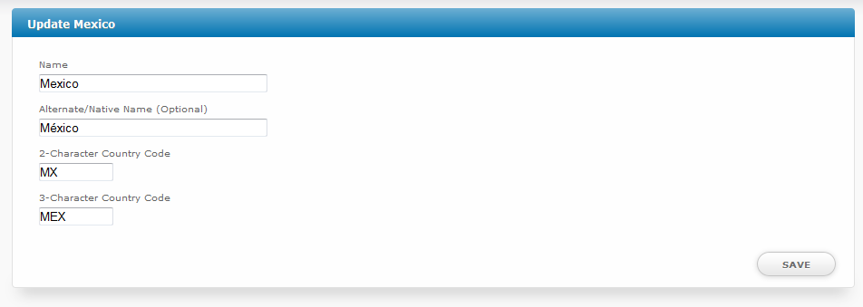

# States & Countries Plugin
***

### Description
This is a plugin for the Blesta billing system that allows for the management of states and countries from the admin interface.
Blesta comes natively with states that use the subdivision codes from [ISO 3166-2](https://en.wikipedia.org/wiki/ISO_3166-2) and countries that use 2 and 3-character country codes from [ISO 3166-1](https://en.wikipedia.org/wiki/ISO_3166-1).
However, these states and countries are not used, or are not accurate enough, for some countries. This plugin provides CRUD (Create, Read, Update, Delete) functionality for these countries and states.
***

### Requirements
* Version 4.0.0, or greater, of Blesta
* PHP 5.4.0+

### How to Install
1. Download the zip containing the plugin's files.
2. Unzip the plugin's files and save them to your Blesta installation under the /plugins/ directory.
3. Login to the Blesta admin interface and navigate to __[Settings] -> [Plugins] -> [Available]__.
4. Click the "Install" button next to the "State/Country Manager" plugin.
5. States and Countries will now be available under __[Tools] -> [States&Countries]__.

### Functionality
* Adding/Updating/Deleting Countries
* Adding/Updating/Deleting States

***

### Permissions
The use of states and countries from this plugin are subject to Staff Group permissions. Staff Group permissions can be managed by editing a staff group under __[Settings] -> [System] -> [Staff] -> [Staff Groups]__.
##### Staff Group Permissions

1. __States&Countries__ | This permission grants access to view states and countries under __[Tools]__.
2. __States&Countries - Manage Countries__ | This permission grants access to add, edit, and delete countries.
3. __States&Countries - Manage States__ | This permission grants access to add, edit, and delete states.  
_NOTE: States and countries are system-level data, and therefore changes to them will affect the entire system and are not limited to specific companies. Giving a staff group permission to change states or countries on one company gives them the ability to change them for all companies._

***

### Screenshots
##### Viewing all States and Countries _In Use_  

***

##### Viewing all States for a Specific Country  
  

***

##### Updating a Country  
  

***

### FAQ
__How do I view states belonging to a country?__  
States become visible once you click on the table row for the country. You can also toggle whether to view all states by clicking the "Show All States" button. By default, only those currently in use are shown.

__Why do some countries and states have a delete option while others do not?__  
States and countries that are in use by the system are not deletable. In order for them to become deletable, all uses of them in the system need to be removed. From the listing page, states and countries that are in use are marked by a green checkmark: . You can hover your mouse over this checkmark to see a tooltip about where it is used in the system.

__What happens when I update a state or country that is in use within the system?__  
Updating a state or country that is in use will update all references in the core system to the new value that you set. For example, if a client contact belongs to the country of "United States", denoted by the "US" 2-character country code, and you changed "US" to "ZZ", then the contact will now belong to the "ZZ" country.  
_The only exception to this is with settings. There is a setting named "country" that stores the default 2-character country code. If you update your default country's 2-character country code, you will need to also update your default country setting for all companies that use it._

__Where are states and countries referenced in the system?__  
As of version 3.5 of Blesta, states and countries are referenced in tax rules, payment accounts, and client contacts. They may also be used in third-party plugins.

***
